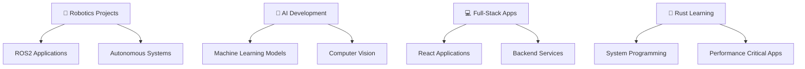
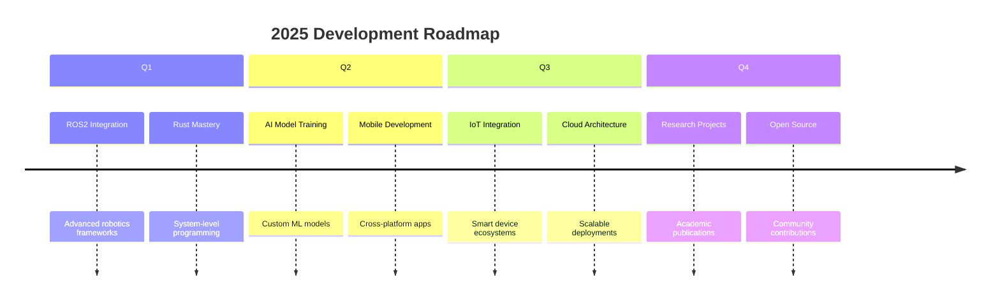

<div align="center">

# 🤖 Rajeet Ash

### *Robotics & AI Engineer | Full-Stack Developer*

[](https://git.io/typing-svg)

</div>

---

## 🎯 About Me

> *Building intelligent systems that bridge the physical and digital worlds*

I'm a passionate **Robotics & AI Engineer** with expertise in full-stack development. Currently pursuing advanced studies in **Robotics and AI**, with a focus on autonomous systems, machine learning, and modern web technologies.

```rust
struct Engineer {
    name: String,
    role: String,
    focus: Vec<String>,
    currently_learning: Vec<String>,
}

let rajeet = Engineer {
    name: "Rajeet Ash".to_string(),
    role: "Robotics & AI Engineer".to_string(),
    focus: vec![
        "Autonomous Systems".to_string(),
        "Machine Learning".to_string(),
        "Full-Stack Development".to_string(),
    ],
    currently_learning: vec!["Rust".to_string(), "ROS2".to_string()],
};
```

<div align="center">

### 🌐 Connect With Me

[](https://discord.gg/F22J6pdnJg)
[](https://github.com/rajeet-04)
[](https://www.linkedin.com/in/rajeet-ash)
[](https://rajeet-04.github.io/rash/)

</div>

---

## 🛠️ Tech Arsenal

<div align="center">

### 🤖 Robotics & AI


### 💻 Full-Stack Development


### 📱 Mobile & Desktop


### 🗄️ Database & Cloud


### ⚡ Core Languages


</div>

---

## 🚀 Featured Projects

<div align="center">

### 🎓 [Classroom Management System](https://github.com/rajeet-04/classroom-frontend)
*A comprehensive full-stack web application for managing university courses and assignments*

**🔧 Tech Stack:** React 19 • Flask • SQLAlchemy • TailwindCSS • shadcn/ui  
**✨ Features:** Course Management | Assignment System | Real-time Chat | Notification System  
**🎯 Impact:** Streamlines educational workflows for instructors and students

<details>
<summary>🔍 Technical Details</summary>

- **Frontend:** Modern React with hooks, Vite build system
- **Backend:** Flask with JWT authentication and role-based access
- **Database:** SQLAlchemy ORM with SQLite/PostgreSQL support
- **Real-time:** WebSocket integration for live chat
- **Security:** bcrypt password hashing, file validation
- **Notifications:** Celery + Redis for background task processing

</details>

---

### 🌌 [E2Eclipse](https://github.com/rajeet-04/E2Eclipse) ⭐ 3
*Advanced Android application showcasing modern Kotlin development*

**🔧 Tech Stack:** Kotlin • Android SDK • Material Design  
**🎯 Purpose:** Demonstrates mobile app architecture and UI/UX principles

---

### 🎵 [Musox Platform](https://github.com/rajeet-04/musox) ⭐ 2 | 🍴 1
*Intelligent music streaming platform with AI-powered features*

---

## 📚 Repository Overview

<!-- REPO_TABLE_START -->
Below is a combined list (public + private) pulled from your GitHub summary. This section is auto-generated by a GitHub Action; do not edit it manually — instead update via the workflow or script.

| Name | Visibility | Language | Last Updated | Notes |
|------|------------|----------|--------------|-------|
| sync-video-frontend | Public | JavaScript | 4 days ago | frontend for sync-video project |
| OFFLINE_FILE_TRANSFER | Public | JavaScript | 4 days ago | Offline peer-to-peer transfer |
| hack | Public | Python | 4 days ago | experiments / small scripts |
| GoogleGeminiUem | Public (fork) | JavaScript | 4 days ago | Forked from Mayank8159/GoogleGeminiUem |
| Recipie-Rescue-Pro | Public | - | last week | GPLv3 project |
| railway | Public | Python | last week | automation / infra code |
| railway-reservation | Public (archived) | Python | last week | archived project |
| Payroll-AI-webapp | Public | TypeScript | 2 weeks ago | payroll webapp (GPLv3) |
| musox_frontend_v2 | Public | JavaScript | 2 weeks ago | frontend v2 |
| technologia | Private | JavaScript | 2 weeks ago | private project |
| player-picture-registration | Private | TypeScript | 3 weeks ago | player picture registration |
| ascii-art-view | Public (fork) | C | 3 weeks ago | Forked from gouwsxander/ascii-view |
| ros-movement | Public | Shell | 3 weeks ago | shell utilities for ROS |
| rash | Public | TypeScript | 3 weeks ago | website project |
| ros-sensor-integration | Public | - | last month | ROS sensor integration |
| helper | Private | Python | last month | helper utilities |
| classroom-frontend | Private | JavaScript | Sep 25 | private classroom frontend |
| SEMiCOLONS | Private | Python | Sep 24 | SIH 2025 team repo (MIT) |
| frontend-GDSCUEM | Private | JavaScript | Sep 23 | private frontend repo |
| rajeet-04 | Public | - | Sep 22 | this repository |
| indiameme | Public | HTML | Sep 21 | small frontend project |
| classroom-backend | Private | Python | Sep 21 | private backend repo |
| E2Eclipse | Public | Kotlin | Sep 14 | Android app |
| skills-introduction-to-github | Public | - | Sep 1 | tutorial / clone repo |
| poster | Public | HTML | Jul 31 | static site/poster project |
| portfolio | Public (fork) | - | Jul 24 | Forked from Debolina2005/portfolio |
| musox | Public | Python | Jun 20 | backend / core of Musox project |
| backend | Private | Python | Jun 16 | private backend |
| testtt | Private | - | - | test / placeholder repo |

<!-- REPO_TABLE_END -->

---

### 📁 [Offline File Transfer](https://github.com/rajeet-04/OFFLINE_FILE_TRANSFER) ⭐ 1 | 🍴 2
*Secure peer-to-peer file sharing system for offline environments*

**🔧 Tech Stack:** JavaScript • P2P Networking • WebRTC  
**✨ Features:** Zero-server architecture • End-to-end encryption • Real-time transfer  
**🎯 Impact:** Enables secure file sharing without internet dependency

---

### 🧠 [RAG System](https://github.com/rajeet-04/rag) ⭐ 1 | 🍴 1
*Retrieval-Augmented Generation system for intelligent document processing*

**🔧 Tech Stack:** Python • Transformers • Vector Databases • NLP  
**✨ Features:** Document Analysis • Contextual Responses • Knowledge Extraction  
**🎯 Application:** Enterprise document intelligence and Q&A systems

---

### 📝 [Gistify](https://github.com/rajeet-04/gistify)
*AI-powered webpage summarizer for efficient content consumption*

**🔧 Tech Stack:** JavaScript • AI APIs • Chrome Extension  
**✨ Features:** Intelligent Summarization • Multi-format Output • Browser Integration  
**🎯 Purpose:** Enhanced productivity through automated content analysis

</div>

---

## 📈 GitHub Analytics

<div align="center">

<!-- Dynamic stats: primary (live) image fetches on each README render. Fallback below. -->


<details>
<summary>Fallback: locally committed stats (used when the live card fails to render)</summary>


</details>

</div>

---

## 🎯 Current Focus & Learning Path

<div align="center">

| 🤖 Robotics | 🧠 AI/ML | 💻 Development |
|:---:|:---:|:---:|
| **ROS2** Ecosystem | **Deep Learning** | **Rust** Programming |
| Autonomous Navigation | Computer Vision | System Architecture |
| Hardware Integration | Natural Language Processing | Performance Optimization |
| Sensor Fusion | Reinforcement Learning | Concurrent Programming |

</div>

---

## 🔭 What I'm Working On

<div align="center">



</div>

---

## 💡 Core Competencies

<div align="center">

### 🎓 Academic Background
**Robotics & AI Department** | Pursuing Advanced Studies in Autonomous Systems

### 🚀 Professional Skills

| Domain | Technologies | Proficiency |
|:---:|:---:|:---:|
| **Robotics** | ROS2, Arduino, Embedded Systems | █████░░░░░ 50% |
| **AI/ML** | Python, TensorFlow, Computer Vision | ██████░░░░ 60% |
| **Web Dev** | React, Node.js, Django, Flask | ███████░░░ 70% |
| **Mobile** | React Native, Kotlin, Expo | ███████░░░ 70% |
| **Systems** | C/C++, Rust, Low-level Programming | ████░░░░░░ 40% |

</div>

---

## 🏆 Achievements & Recognition

<div align="center">


### 🎯 Project Impact
- **21+ Repositories** across diverse domains
- **Active Contributor** to open-source projects
- **Community Engagement** through Discord and collaborative development
- **Cross-platform Development** expertise

</div>

---

## 📊 Development Activity

<div align="center">


</div>

---

## 💭 Philosophy & Approach

<div align="center">

> *"The intersection of robotics and AI isn't just about building machines—it's about creating intelligence that can adapt, learn, and enhance human capabilities."*

### 🔮 Vision
Building **autonomous systems** that seamlessly integrate with human workflows, combining the precision of robotics with the adaptability of artificial intelligence.

### 🎯 Mission
Developing **scalable solutions** that solve real-world problems through innovative technology, open collaboration, and continuous learning.

</div>

---

## 🔧 Current Projects & Roadmap

<div align="center">



</div>

---

## 💬 Let's Collaborate!

<div align="center">

### 🤝 Open to Collaboration On:
- 🤖 **Robotics Projects** using ROS2 and modern frameworks
- 🧠 **AI/ML Applications** for real-world problem solving
- 🌐 **Open Source Contributions** that make a difference
- 📚 **Educational Technology** for enhanced learning experiences

### 💡 Looking for Help With:
- 🔬 **Advanced AI Research** in robotics applications
- 🤖 **Autonomous System Design** and implementation
- 🌍 **Community Building** around robotics and AI

</div>

---

## 🎨 Random Developer Wisdom

<div align="center">


</div>

---

<div align="center">

### 🚀 *"Innovation distinguishes between a leader and a follower"* - Steve Jobs

**Ready to build the future together?**

---

### 📬 Get In Touch

Feel free to reach out for collaborations, discussions about robotics and AI, or just to connect!

*⭐ Star my repositories if you find them useful | 🍴 Fork and contribute to make them better!*

</div>

---

<div align="center">


</div>
