<div align="center">

# 🤖 Rajeet Ash

### *Robotics & AI Engineer | Full-Stack Developer*

[](https://git.io/typing-svg)

</div>

---

## 🎯 About Me

> *Building intelligent systems that bridge the physical and digital worlds*

I'm a passionate **Robotics & AI Engineer** with expertise in full-stack development. Currently pursuing advanced studies in **Robotics and AI**, with a focus on autonomous systems, machine learning, and modern web technologies.

```rust
struct Engineer {
    name: String,
    role: String,
    focus: Vec<String>,
    currently_learning: Vec<String>,
}

let rajeet = Engineer {
    name: "Rajeet Ash".to_string(),
    role: "Robotics & AI Engineer".to_string(),
    focus: vec![
        "Autonomous Systems".to_string(),
        "Machine Learning".to_string(),
        "Full-Stack Development".to_string(),
    ],
    currently_learning: vec!["Rust".to_string(), "ROS2".to_string()],
};
```

<div align="center">

### 🌐 Connect With Me

[](https://discord.gg/F22J6pdnJg)
[](https://github.com/rajeet-04)
[](https://www.linkedin.com/in/rajeet-ash)
[](https://rajeet-04.github.io/rash/)

</div>

---

## 🛠️ Tech Arsenal

<div align="center">

### 🤖 Robotics & AI


### 💻 Full-Stack Development


### 📱 Mobile & Desktop


### 🗄️ Database & Cloud


### ⚡ Core Languages


</div>

---

## 🚀 Featured Projects

<div align="center">

### 🎓 [Classroom Management System](https://github.com/rajeet-04/classroom-frontend)
*A comprehensive full-stack web application for managing university courses and assignments*

**🔧 Tech Stack:** React 19 • Flask • SQLAlchemy • TailwindCSS • shadcn/ui  
**✨ Features:** Course Management | Assignment System | Real-time Chat | Notification System  
**🎯 Impact:** Streamlines educational workflows for instructors and students

<details>
<summary>🔍 Technical Details</summary>

- **Frontend:** Modern React with hooks, Vite build system
- **Backend:** Flask with JWT authentication and role-based access
- **Database:** SQLAlchemy ORM with SQLite/PostgreSQL support
- **Real-time:** WebSocket integration for live chat
- **Security:** bcrypt password hashing, file validation
- **Notifications:** Celery + Redis for background task processing

</details>

---

### 🌌 [E2Eclipse](https://github.com/rajeet-04/E2Eclipse) ⭐ 3
*Advanced Android application showcasing modern Kotlin development*

**🔧 Tech Stack:** Kotlin • Android SDK • Material Design  
**🎯 Purpose:** Demonstrates mobile app architecture and UI/UX principles

---

### 🎵 [Musox Platform](https://github.com/rajeet-04/musox) ⭐ 2 | 🍴 1
*Intelligent music streaming platform with AI-powered features*

---

## 📚 Repository Overview

<!-- REPO_TABLE_START -->
Below is a combined list (public + private) pulled from your GitHub summary. This section is auto-generated by a GitHub Action; do not edit it manually.

| Name | Visibility | Language | Last Updated | Notes |
|------|------------|----------|--------------|-------|
| [rajeet-04](https://github.com/rajeet-04/rajeet-04) | Public | JavaScript | 12/12/2025 |  |
| [info-guide](https://github.com/rajeet-04/info-guide) | Public | TypeScript | 10/12/2025 |  |
| [Payroll-AI-webapp](https://github.com/rajeet-04/Payroll-AI-webapp) | Public | TypeScript | 10/12/2025 | GPL-3.0 |
| [Musox](https://github.com/rajeet-04/Musox) | Private | Dart | 08/12/2025 |  |
| [musox_archive](https://github.com/rajeet-04/musox_archive) | Public | Python | 08/12/2025 | archived |
| [classroom-frontend](https://github.com/rajeet-04/classroom-frontend) | Private | JavaScript | 08/12/2025 |  |
| [rash](https://github.com/rajeet-04/rash) | Public | TypeScript | 04/12/2025 | Apache-2.0 |
| [musox_frontend_v2](https://github.com/rajeet-04/musox_frontend_v2) | Public | JavaScript | 09/11/2025 |  |
| [uni-grade-marking-system](https://github.com/rajeet-04/uni-grade-marking-system) | Public | TypeScript | 04/11/2025 |  |
| [Terminal](https://github.com/rajeet-04/Terminal) | Private | - | 31/10/2025 |  |
| [GoogleGeminiUem](https://github.com/rajeet-04/GoogleGeminiUem) | Public (fork) | JavaScript | 31/10/2025 |  |
| [Recipie-Rescue-Pro](https://github.com/rajeet-04/Recipie-Rescue-Pro) | Public | - | 27/10/2025 | GPL-3.0 |
| [railway](https://github.com/rajeet-04/railway) | Public | Python | 25/10/2025 |  |
| [ascii-art-view](https://github.com/rajeet-04/ascii-art-view) | Public (fork) | - | 25/10/2025 | MIT |
| [railway-reservation](https://github.com/rajeet-04/railway-reservation) | Public | Python | 25/10/2025 | archived |
| [GoogleGeminiUem](https://github.com/Mayank8159/GoogleGeminiUem) | Public | JavaScript | 24/10/2025 |  |
| [technologia](https://github.com/rajeet-04/technologia) | Private | JavaScript | 21/10/2025 |  |
| [player-picture-registration](https://github.com/rajeet-04/player-picture-registration) | Private | TypeScript | 17/10/2025 |  |
| [ros-movement](https://github.com/rajeet-04/ros-movement) | Public | Shell | 14/10/2025 |  |
| [ros-sensor-integration](https://github.com/rajeet-04/ros-sensor-integration) | Public | - | 10/10/2025 | Apache-2.0 |
| [helper](https://github.com/rajeet-04/helper) | Private | Python | 08/10/2025 |  |
| [gistify](https://github.com/xthxr/gistify) | Public | JavaScript | 06/10/2025 |  |
| [E2Eclipse](https://github.com/rajeet-04/E2Eclipse) | Public | Kotlin | 06/10/2025 |  |
| [frontend-GDSCUEM](https://github.com/rajeet-04/frontend-GDSCUEM) | Private | JavaScript | 23/09/2025 |  |
| [indiameme](https://github.com/rajeet-04/indiameme) | Public | HTML | 21/09/2025 |  |
| [SEMiCOLONS](https://github.com/rajeet-04/SEMiCOLONS) | Private | Python | 21/09/2025 | MIT |
| [classroom-backend](https://github.com/rajeet-04/classroom-backend) | Private | Python | 21/09/2025 |  |
| [technologia.uem.edu.in](https://github.com/iemaserver/technologia.uem.edu.in) | Public | JavaScript | 17/08/2025 |  |
| [poster](https://github.com/rajeet-04/poster) | Public | HTML | 31/07/2025 |  |
| [portfolio](https://github.com/rajeet-04/portfolio) | Public (fork) | - | 24/07/2025 |  |
| [backend](https://github.com/rajeet-04/backend) | Private | Python | 16/06/2025 |  |
| [OFFLINE_FILE_TRANSFER](https://github.com/rajeet-04/OFFLINE_FILE_TRANSFER) | Public | JavaScript | 15/06/2025 |  |
| [testtt](https://github.com/rajeet-04/testtt) | Private | JavaScript | 10/06/2025 |  |
| [proj](https://github.com/rajeet-04/proj) | Private | JavaScript | 02/06/2025 |  |
| [gistify](https://github.com/rajeet-04/gistify) | Public (fork) | - | 24/05/2025 |  |
| [STREAMY](https://github.com/rajeet-04/STREAMY) | Private | - | 23/05/2025 | Apache-2.0 |
| [Deepali](https://github.com/DeepaliSingh10/Deepali) | Public | HTML | 12/05/2025 |  |
| [signin](https://github.com/DeepaliSingh10/signin) | Public | HTML | 11/05/2025 |  |
| [signin](https://github.com/rajeet-04/signin) | Public | HTML | 11/05/2025 |  |
| [web](https://github.com/rajeet-04/web) | Public | - | 11/05/2025 |  |
| [sync-video-frontend](https://github.com/rajeet-04/sync-video-frontend) | Public | JavaScript | 11/05/2025 |  |
| [effy](https://github.com/rajeet-04/effy) | Public | TypeScript | 18/04/2025 |  |
| [dti](https://github.com/rajeet-04/dti) | Public | Python | 04/04/2025 |  |
| [vid](https://github.com/rajeet-04/vid) | Public | Dockerfile | 08/03/2025 |  |
| [sync-video-backend](https://github.com/rajeet-04/sync-video-backend) | Public | JavaScript | 08/03/2025 |  |
| [my_hugo_site](https://github.com/rajeet-04/my_hugo_site) | Private | HTML | 27/02/2025 |  |
| [hack](https://github.com/rajeet-04/hack) | Public | Python | 08/02/2025 |  |
| [efy](https://github.com/rajeet-04/efy) | Public | - | 08/02/2025 |  |
| [rag](https://github.com/rajeet-04/rag) | Public | Python | 22/01/2025 |  |
| [skills-introduction-to-github](https://github.com/rajeet-04/skills-introduction-to-github) | Public | - | 19/12/2024 | MIT |
| [test](https://github.com/rajeet-04/test) | Private | CSS | 24/10/2024 |  |

<!-- REPO_TABLE_END -->


---

### 📁 [Offline File Transfer](https://github.com/rajeet-04/OFFLINE_FILE_TRANSFER) ⭐ 1 | 🍴 2
*Secure peer-to-peer file sharing system for offline environments*

**🔧 Tech Stack:** JavaScript • P2P Networking • WebRTC  
**✨ Features:** Zero-server architecture • End-to-end encryption • Real-time transfer  
**🎯 Impact:** Enables secure file sharing without internet dependency

---

### 🧠 [RAG System](https://github.com/rajeet-04/rag) ⭐ 1 | 🍴 1
*Retrieval-Augmented Generation system for intelligent document processing*

**🔧 Tech Stack:** Python • Transformers • Vector Databases • NLP  
**✨ Features:** Document Analysis • Contextual Responses • Knowledge Extraction  
**🎯 Application:** Enterprise document intelligence and Q&A systems

---

### 📝 [Gistify](https://github.com/rajeet-04/gistify)
*AI-powered webpage summarizer for efficient content consumption*

**🔧 Tech Stack:** JavaScript • AI APIs • Chrome Extension  
**✨ Features:** Intelligent Summarization • Multi-format Output • Browser Integration  
**🎯 Purpose:** Enhanced productivity through automated content analysis

</div>

---

## 📈 GitHub Analytics

<div align="center">

<!-- Dynamic stats: primary (live) image fetches on each README render. Fallback below. -->


<details>
<summary>Fallback: locally committed stats (used when the live card fails to render)</summary>


</details>

</div>

> NOTE: If the external GitHub Readme Stats service is unavailable or paused, this repository uses a workflow fallback to generate a local `gh_stats.svg` by querying the GitHub API (GraphQL). To include private repo metrics in fallback mode, add a personal access token secret (`GH_PAT`) in the repository and give it repo-level read access (or fine-grained token with `Contents: Read & write` permission for the repo(s)).
---

## 🎯 Current Focus & Learning Path

<div align="center">

| 🤖 Robotics | 🧠 AI/ML | 💻 Development |
|:---:|:---:|:---:|
| **ROS2** Ecosystem | **Deep Learning** | **Rust** Programming |
| Autonomous Navigation | Computer Vision | System Architecture |
| Hardware Integration | Natural Language Processing | Performance Optimization |
| Sensor Fusion | Reinforcement Learning | Concurrent Programming |

</div>

---

## 🔭 What I'm Working On

```mermaid
graph TD
    A[🤖 Robotics Projects] --> B[ROS2 Applications]
    A --> C[Autonomous Systems]
    D[🧠 AI Development] --> E[Machine Learning Models]
    D --> F[Computer Vision]
    G[💻 Full-Stack Apps] --> H[React Applications]
    G --> I[Backend Services]
    J[🦀 Rust Learning] --> K[System Programming]
    J --> L[Performance Critical Apps]
```

<div align="center">



</div>

---

## 💡 Core Competencies

<div align="center">

### 🎓 Academic Background
**Robotics & AI Department** | Pursuing Advanced Studies in Autonomous Systems

### 🚀 Professional Skills

| Domain | Technologies | Proficiency |
|:---:|:---:|:---:|
| **Robotics** | ROS2, Arduino, Embedded Systems | █████░░░░░ 50% |
| **AI/ML** | Python, TensorFlow, Computer Vision | ██████░░░░ 60% |
| **Web Dev** | React, Node.js, Django, Flask | ███████░░░ 70% |
| **Mobile** | React Native, Kotlin, Expo | ███████░░░ 70% |
| **Systems** | C/C++, Rust, Low-level Programming | ████░░░░░░ 40% |

</div>

---

## 🏆 Achievements & Recognition

<div align="center">


### 🎯 Project Impact
- **21+ Repositories** across diverse domains
- **Active Contributor** to open-source projects
- **Community Engagement** through Discord and collaborative development
- **Cross-platform Development** expertise

</div>

---

## 📊 Development Activity

<div align="center">


</div>

---

## 💭 Philosophy & Approach

<div align="center">

> *"The intersection of robotics and AI isn't just about building machines—it's about creating intelligence that can adapt, learn, and enhance human capabilities."*

### 🔮 Vision
Building **autonomous systems** that seamlessly integrate with human workflows, combining the precision of robotics with the adaptability of artificial intelligence.

### 🎯 Mission
Developing **scalable solutions** that solve real-world problems through innovative technology, open collaboration, and continuous learning.

</div>

---

## 🔧 Current Projects & Roadmap

<div align="center">


</div>

---

## 💬 Let's Collaborate!

<div align="center">

### 🤝 Open to Collaboration On:
- 🤖 **Robotics Projects** using ROS2 and modern frameworks
- 🧠 **AI/ML Applications** for real-world problem solving
- 🌐 **Open Source Contributions** that make a difference
- 📚 **Educational Technology** for enhanced learning experiences

### 💡 Looking for Help With:
- 🔬 **Advanced AI Research** in robotics applications
- 🤖 **Autonomous System Design** and implementation
- 🌍 **Community Building** around robotics and AI

</div>

---

## 🎨 Random Developer Wisdom

<div align="center">


</div>

---

<div align="center">

### 🚀 *"Innovation distinguishes between a leader and a follower"* - Steve Jobs

**Ready to build the future together?**

---

### 📬 Get In Touch

Feel free to reach out for collaborations, discussions about robotics and AI, or just to connect!

*⭐ Star my repositories if you find them useful | 🍴 Fork and contribute to make them better!*

</div>

---

<div align="center">


</div>
